# Docker Lab Submission

**Name:** Ayush Patel  
**Roll No:** 202301084

All steps below were performed on a Linux machine (user `ayushpatel`) with Docker Engine 29.6.2 and Docker Compose v5.3.1. Every screenshot is the real output of the commands shown above it.

## Project files

| File | Purpose |
|---|---|
| `Dockerfile` | Recipe to build my custom Nginx image |
| `docker-compose.yml` | Deploys the app with one command (port 8081 + named volume) |
| `app/index.html` | Web page served by the container (shows name and roll number) |
| `screenshots/` | Terminal and browser screenshots for every step |
| `Docker_Lab_Report.pdf` | This report as a PDF for submission |

## Steps

1. [Check Docker installation](#step-1-check-docker-installation)
2. [Run the first container (hello-world)](#step-2-run-the-first-container-hello-world)
3. [Pull images and list them](#step-3-pull-images-and-list-them)
4. [Run a command inside a container](#step-4-run-a-command-inside-a-container)
5. [Run a container in background with port mapping](#step-5-run-a-container-in-background-with-port-mapping)
6. [Logs, exec and inspect](#step-6-logs-exec-and-inspect)
7. [Container lifecycle: stop, start, remove](#step-7-container-lifecycle-stop-start-remove)
8. [Write a Dockerfile](#step-8-write-a-dockerfile)
9. [Build a custom image](#step-9-build-a-custom-image)
10. [Run the custom image (deployment)](#step-10-run-the-custom-image-deployment)
11. [Named volumes (persistent data)](#step-11-named-volumes-persistent-data)
12. [Bind mount (host folder into container)](#step-12-bind-mount-host-folder-into-container)
13. [Docker networks](#step-13-docker-networks)
14. [Tag and save an image](#step-14-tag-and-save-an-image)
15. [Deploy with Docker Compose](#step-15-deploy-with-docker-compose)
16. [Monitoring: stats and compose logs](#step-16-monitoring-stats-and-compose-logs)
17. [Clean up](#step-17-clean-up)

## Step 1: Check Docker installation

| Command | Purpose |
|---|---|
| `docker --version` | Shows the installed Docker client version, confirming Docker is installed. |
| `docker compose version` | Shows the Docker Compose plugin version (used later for multi-container deployment). |
| `docker info --format 'Server: {{.ServerVersion}} &#124; Containers: {{.Containers}} &#124; Images: {{.Images}} &#124; OS: {{.OperatingSystem}}'` | Prints key details about the Docker daemon (engine version, number of containers/images, OS) to confirm the daemon is running. |

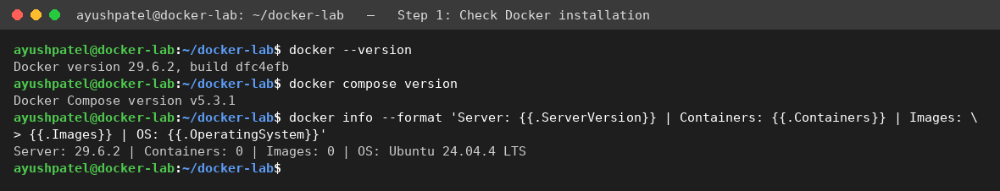

## Step 2: Run the first container (hello-world)

| Command | Purpose |
|---|---|
| `docker run hello-world` | Downloads the hello-world image (if not present), creates a container from it and runs it. The container prints a message and exits - proving Docker works end to end. |

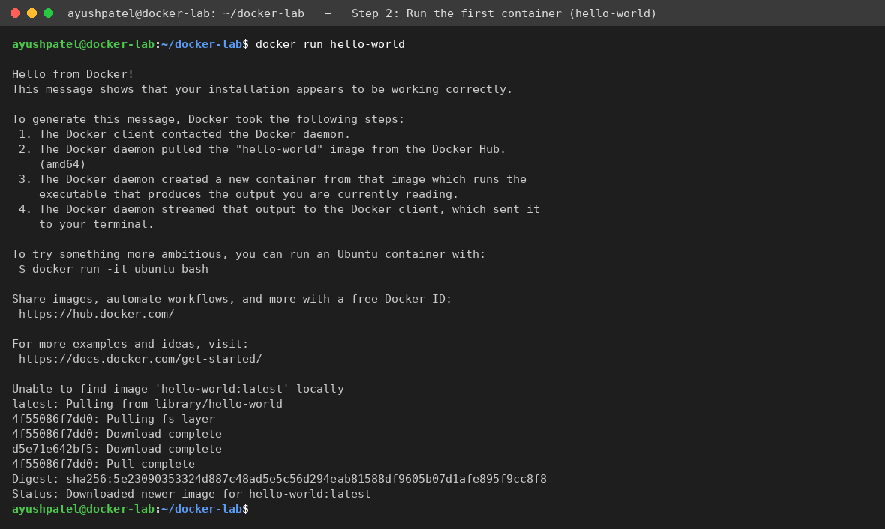

## Step 3: Pull images and list them

| Command | Purpose |
|---|---|
| `docker pull nginx:alpine` | Downloads the official Nginx web-server image (small Alpine variant) from Docker Hub. |
| `docker pull alpine:latest` | Downloads the tiny Alpine Linux base image. |
| `docker images` | Lists all images stored locally with their repository, tag, ID and size. |

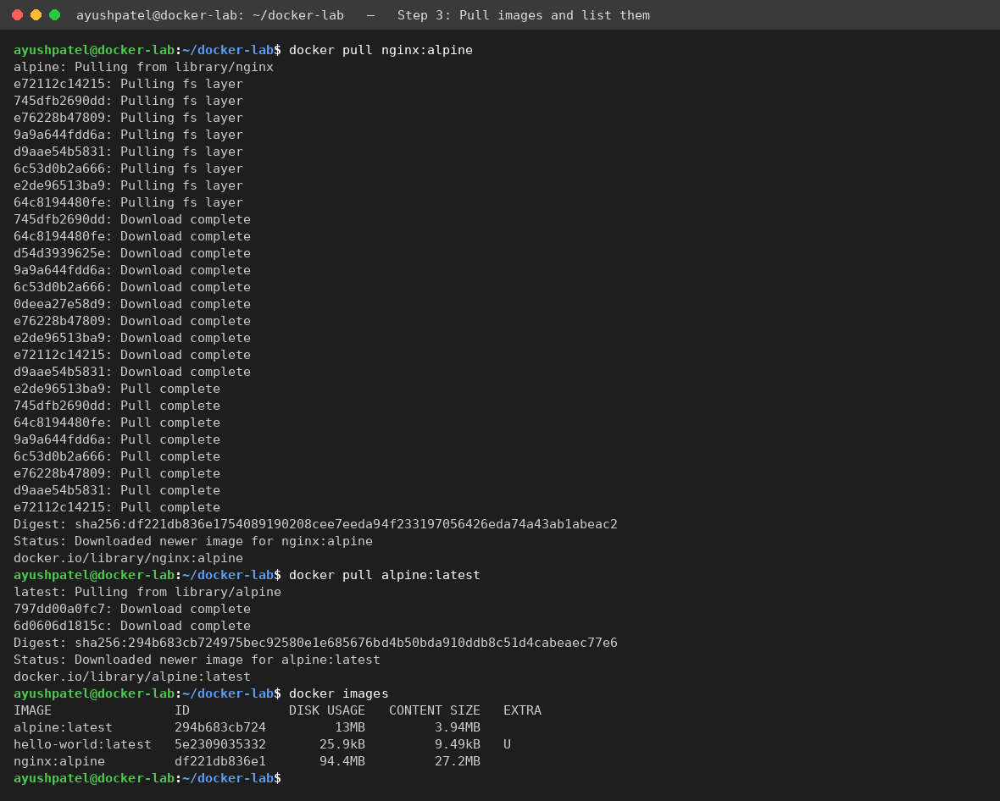

## Step 4: Run a command inside a container

| Command | Purpose |
|---|---|
| `docker run --rm alpine cat /etc/os-release` | Starts an Alpine container, runs one command inside it (shows the container's OS) and removes the container afterwards (--rm). |
| `docker run --rm alpine sh -c 'echo Hello from Ayush Patel, Roll No 202301084; hostname'` | Runs a small shell script inside a container. The hostname printed is the container ID, showing each container is an isolated environment. (Interactive form: docker run -it alpine sh) |

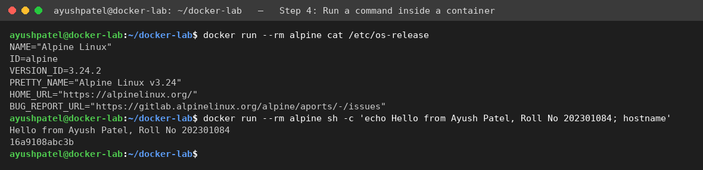

## Step 5: Run a container in background with port mapping

| Command | Purpose |
|---|---|
| `docker run -d --name ayushpatel-nginx -p 8080:80 nginx:alpine` | Starts Nginx in detached mode (-d, background), names it ayushpatel-nginx and maps host port 8080 to container port 80 (-p). |
| `docker ps` | Lists running containers with ID, image, status and port mappings. |
| `curl -s http://localhost:8080 &#124; grep -i '<title>'` | Sends an HTTP request to the container through the mapped port to prove the web server is reachable. |

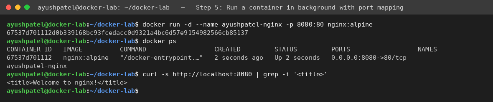

## Step 6: Logs, exec and inspect

| Command | Purpose |
|---|---|
| `docker logs ayushpatel-nginx 2>&1 &#124; tail -n 4` | Shows the output/logs written by the container (here the last 4 lines, including our curl request). |
| `docker exec ayushpatel-nginx ls -l /usr/share/nginx/html` | Runs a command inside the already-running container (docker exec) - here listing Nginx's web folder. |
| `docker inspect --format 'Name={{.Name}} IP={{range .NetworkSettings.Networks}}{{.IPAddress}}{{end}} Status={{.State.Status}}' ayushpatel-nginx` | Shows low-level details of the container (name, internal IP address, state) using a Go template filter. |

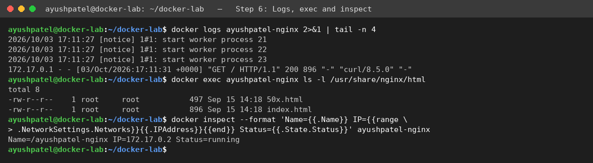

## Step 7: Container lifecycle: stop, start, remove

| Command | Purpose |
|---|---|
| `docker stop ayushpatel-nginx` | Gracefully stops the running container. |
| `docker ps -a --filter name=ayushpatel-nginx` | Lists all containers including stopped ones (-a); status is now Exited. |
| `docker start ayushpatel-nginx` | Starts the stopped container again (same container, same settings). |
| `docker ps --filter name=ayushpatel-nginx` | Confirms the container is Up again. |
| `docker rm -f ayushpatel-nginx` | Force-removes the container (stops it first because of -f). |

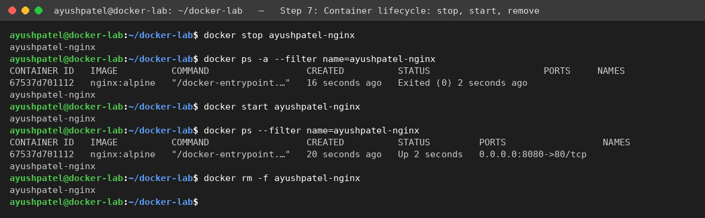

## Step 8: Write a Dockerfile

| Command | Purpose |
|---|---|
| `ls -R` | Shows the project files: the Dockerfile, the web page in app/, and the Compose file. |
| `cat Dockerfile` | Displays the Dockerfile. FROM picks the base image, LABEL adds metadata, COPY adds our page, EXPOSE documents the port, CMD sets the start command. |

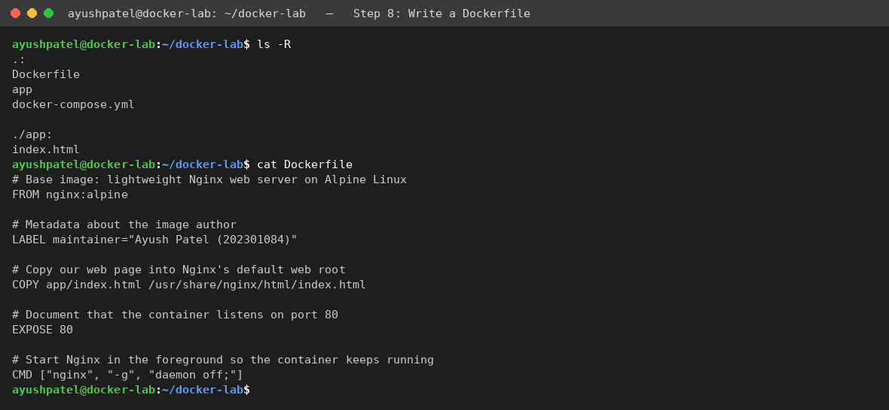

## Step 9: Build a custom image

| Command | Purpose |
|---|---|
| `docker build -t ayushpatel/docker-lab-web:1.0 .` | Builds a new image from the Dockerfile in the current folder (.) and tags it (-t) as ayushpatel/docker-lab-web:1.0. |
| `docker images ayushpatel/docker-lab-web` | Lists the newly built image. |
| `docker history ayushpatel/docker-lab-web:1.0 &#124; head -n 6` | Shows the layers of the image; the top layers correspond to our Dockerfile instructions. |

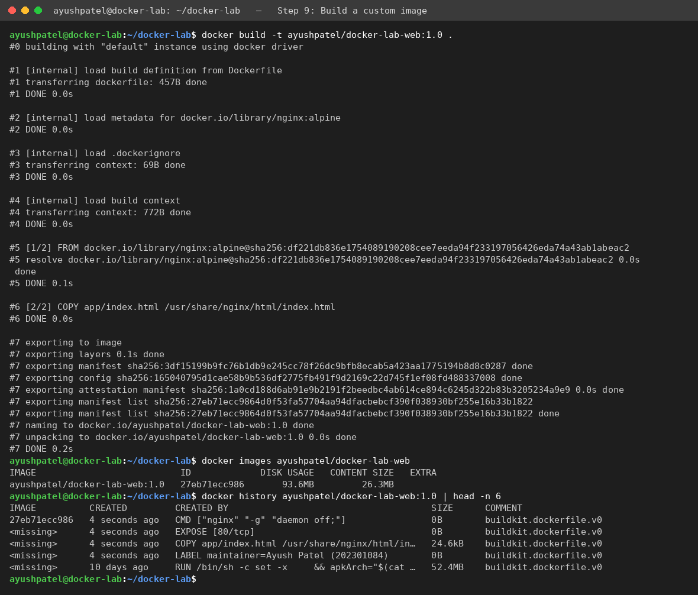

## Step 10: Run the custom image (deployment)

| Command | Purpose |
|---|---|
| `docker run -d --name ayushpatel-web -p 8082:80 ayushpatel/docker-lab-web:1.0` | Deploys our own image as a container on host port 8082. |
| `docker ps --filter name=ayushpatel-web` | Confirms the container is running. |
| `curl -s http://localhost:8082 &#124; grep -E 'Name&#124;Roll'` | Fetches the page from the container - it shows my name and roll number, proving the custom image works. |

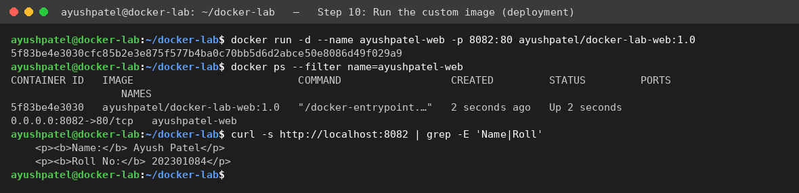

*Browser view of the custom image running with docker run (port 8082).*

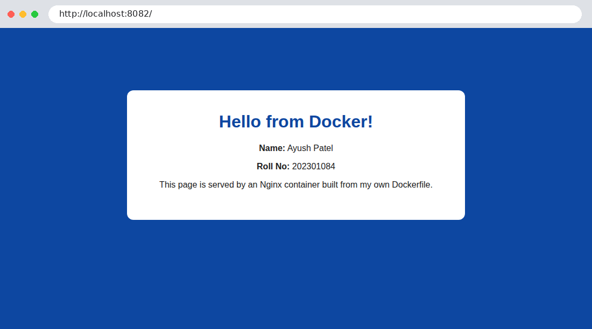

## Step 11: Named volumes (persistent data)

| Command | Purpose |
|---|---|
| `docker volume create ayush-data` | Creates a named volume - storage managed by Docker that lives outside any container. |
| `docker volume ls` | Lists all volumes. |
| `docker run --rm -v ayush-data:/data alpine sh -c "echo 'Ayush Patel - 202301084' > /data/student.txt"` | Container #1 mounts the volume at /data and writes a file, then is deleted (--rm). |
| `docker run --rm -v ayush-data:/data alpine cat /data/student.txt` | Container #2 (a brand new one) mounts the same volume and reads the file - data persisted after container #1 was removed. |
| `docker volume inspect ayush-data` | Shows volume details such as where Docker stores it on the host (Mountpoint). |

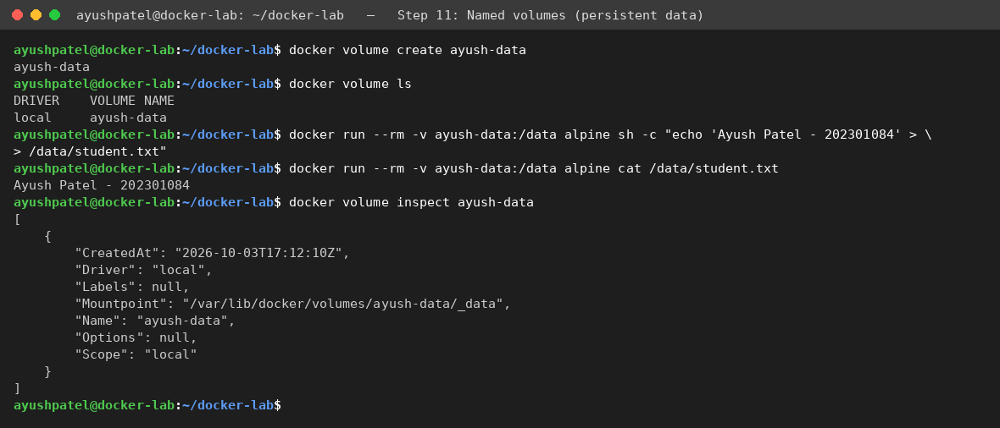

## Step 12: Bind mount (host folder into container)

| Command | Purpose |
|---|---|
| `mkdir -p site && echo '<h1>Bind mount page by Ayush Patel (202301084)</h1>' > site/index.html` | Creates a folder on the host with a simple HTML page. |
| `docker run -d --name ayushpatel-bind -p 8083:80 -v "$(pwd)/site":/usr/share/nginx/html:ro nginx:alpine` | Runs Nginx and mounts the host folder into the container's web root (read-only, :ro). |
| `curl -s http://localhost:8083` | The container serves the host file. |
| `echo '<h1>Updated on the host - no rebuild needed!</h1>' > site/index.html && curl -s http://localhost:8083` | Edit the file on the host; the container immediately serves the new content because it is the same folder. |

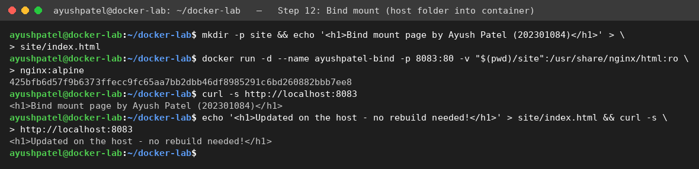

## Step 13: Docker networks

| Command | Purpose |
|---|---|
| `docker network create ayush-net` | Creates a user-defined bridge network so containers can talk to each other by name. |
| `docker run -d --name ayush-server --network ayush-net nginx:alpine` | Starts a web server container attached to the network. |
| `docker run --rm --network ayush-net alpine wget -qO- http://ayush-server &#124; grep -i '<title>'` | A second container on the same network reaches the server using its container name (built-in DNS). |
| `docker network ls` | Lists networks (bridge, host, none and our ayush-net). |

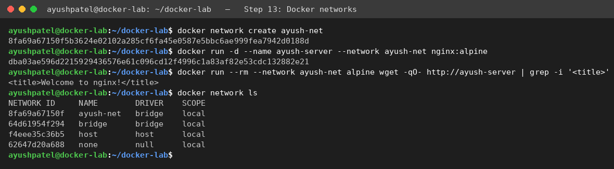

## Step 14: Tag and save an image

| Command | Purpose |
|---|---|
| `docker tag ayushpatel/docker-lab-web:1.0 ayushpatel/docker-lab-web:latest` | Adds another tag (name) to the same image - this is how images are prepared for pushing to a registry (docker login + docker push). |
| `docker images ayushpatel/docker-lab-web` | Both tags point to the same IMAGE ID. |
| `docker save -o docker-lab-web.tar ayushpatel/docker-lab-web:1.0 && ls -lh docker-lab-web.tar` | Exports the image to a .tar file so it can be copied to another machine and loaded with docker load. |

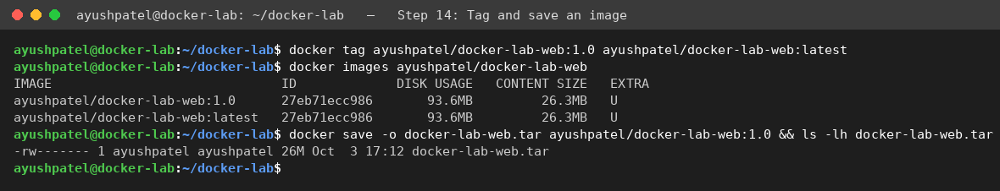

## Step 15: Deploy with Docker Compose

| Command | Purpose |
|---|---|
| `cat docker-compose.yml` | Shows the Compose file: one service built from our Dockerfile, port 8081, and a named volume for Nginx logs. |
| `docker compose up -d --build` | Builds the image and starts all services in the background with a single command. |
| `docker compose ps` | Lists the containers managed by this Compose project. |
| `curl -s http://localhost:8081 &#124; grep -E 'Name&#124;Roll'` | Verifies the Compose deployment is serving the page. |

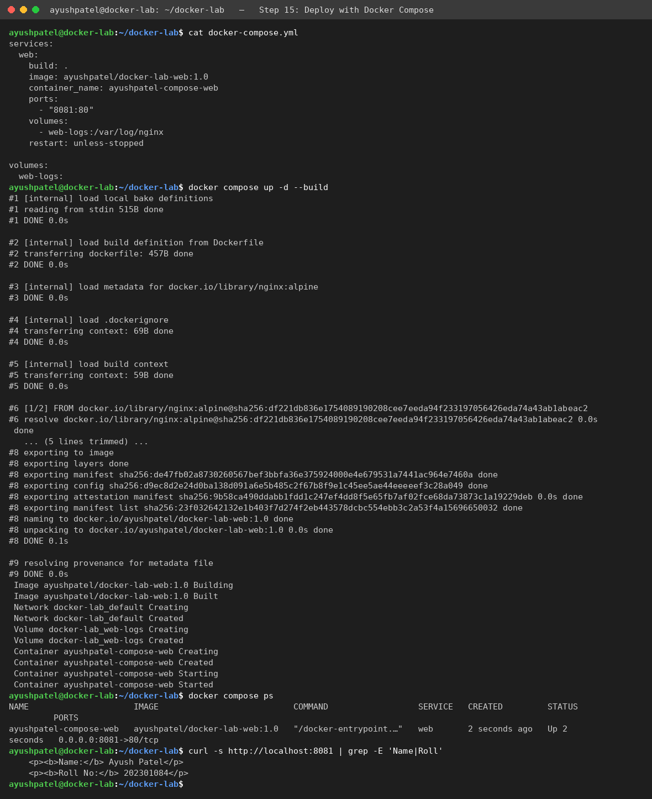

*Browser view of the same app deployed with Docker Compose (port 8081).*

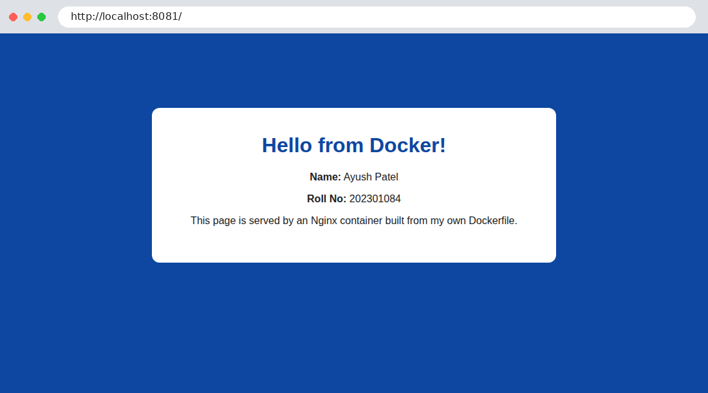

## Step 16: Monitoring: stats and compose logs

| Command | Purpose |
|---|---|
| `docker stats --no-stream --format 'table {{.Name}}\t{{.CPUPerc}}\t{{.MemUsage}}'` | Shows a one-time snapshot of CPU and memory usage of running containers. |
| `docker compose logs --tail 3` | Shows the last log lines of the Compose services. |
| `docker system df` | Shows how much disk space images, containers and volumes use. |

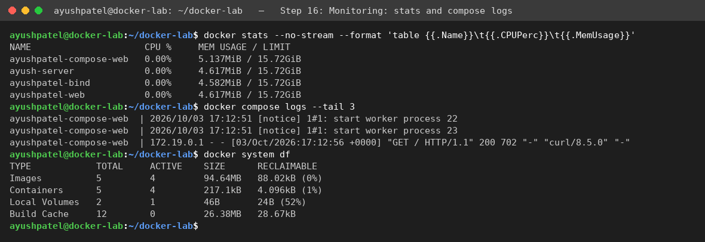

## Step 17: Clean up

| Command | Purpose |
|---|---|
| `docker compose down -v` | Stops and removes the Compose containers, network and volume (-v). |
| `docker rm -f ayushpatel-web ayushpatel-bind ayush-server` | Removes the remaining containers. |
| `docker network rm ayush-net && docker volume rm ayush-data` | Removes the custom network and volume. |
| `docker container prune -f` | Deletes all stopped containers (e.g. the hello-world one). |
| `docker ps -a` | Confirms no containers are left. |

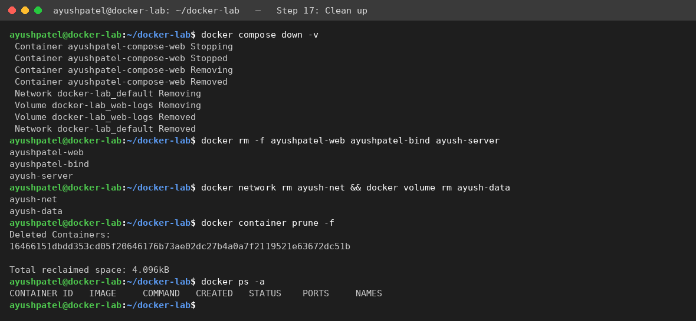

## Conclusion

In this lab I installed and verified Docker, ran containers from public images, managed the container lifecycle, wrote a Dockerfile and built my own image, used named volumes and bind mounts for data, connected containers with a custom network, tagged/saved the image, and deployed the application with Docker Compose. The browser screenshots confirm the application ran successfully.
